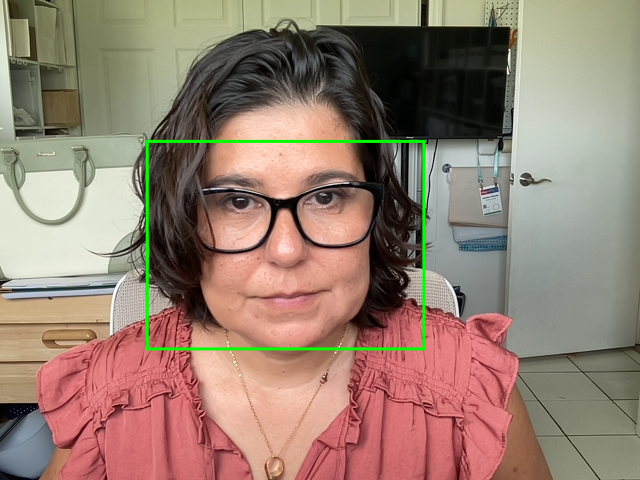
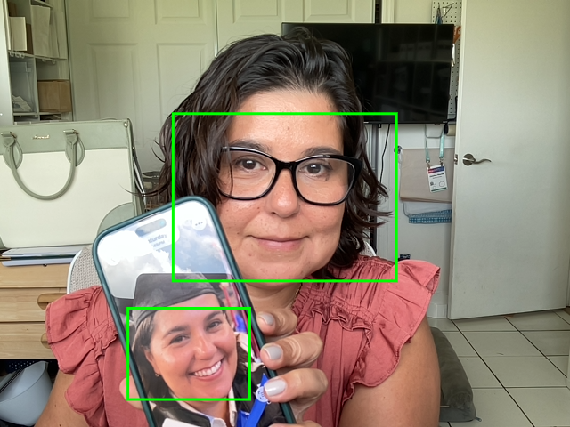

# Module 7 — Face Detection Camera App

This project is a real-time face detection web application built using **TensorFlow.js** and the **BlazeFace model**.

It accesses the user’s webcam, detects faces in real time, and draws bounding boxes over the detected faces using an HTML5 canvas.

---

## ✨ Features

- 📷 Live webcam feed
- 🧠 Real-time face detection
- 🟩 Face bounding box visualization
- 📸 Screenshot capture functionality
- 🌐 Works in Chrome and Safari

---

## 🛠 Technologies Used

- HTML5
- JavaScript
- TensorFlow.js
- BlazeFace model
- HTML Canvas API

---

## 🚀 How to Use

1. Open the app in a browser (Chrome recommended)
2. Click **Start Camera**
3. Allow camera permissions
4. Faces will be detected automatically
5. Click **Screenshot** to save an image

---

## 🔗 Live Demo

👉 (https://candid-praline-63dddf.netlify.app/)

---

## 📸 Demo Notes

The application was tested using:
- Live webcam input
- Printed/photo images for face detection when testing alone

---

## 💡 What I Learned

- How to access and control the webcam using JavaScript
- How to use pre-trained machine learning models in the browser
- Handling async behavior (camera + model loading)
- Drawing and updating graphics using canvas in real time
- Debugging real-time applications

---

## ⚠️ Notes

- Requires camera permissions to function
- Works best on modern browsers
- Internet connection required to load TensorFlow model

- ## 📸 Screenshots

---

## 👩‍💻 Author

Catalina Obando
